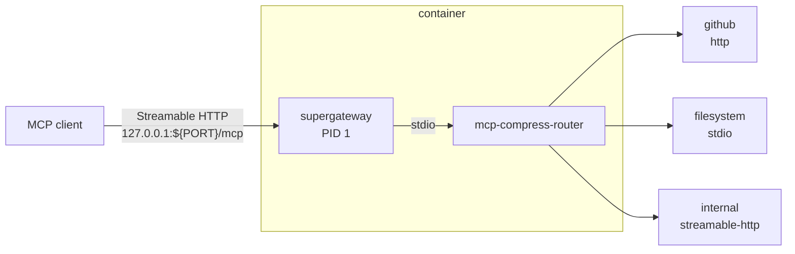
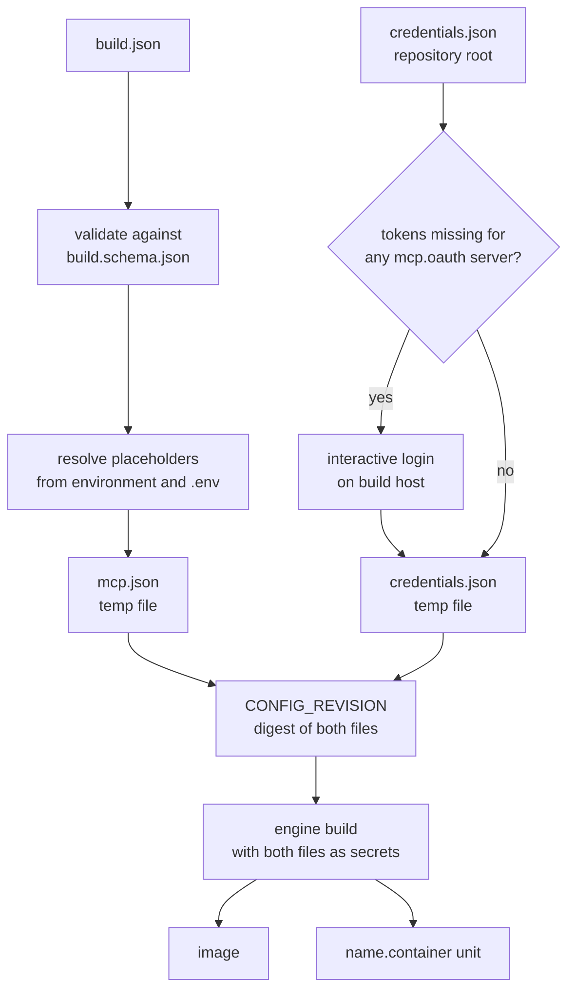

# mcp-aggregator

Builds a container image that presents any number of MCP servers to a local client as a single Streamable HTTP endpoint, collapsed behind the two tools that [
`mcp-compress-router`](https://www.npmjs.com/package/mcp-compress-router) exposes: `get_tool_schema` and `invoke_tool`.

Agent clients cap the number of registered tools — 128 for GitHub Copilot CLI — and every registered tool consumes context. Routing servers through the compressor keeps them all reachable at a fixed
cost of two tools.

## Architecture



> [!NOTE]
> Configuration is baked into the image at build time as build secrets, so a running container needs no host configuration beyond a state volume.

## Requirements

- Node.js **>= 24** with **npm** on the build host
- Podman, or Docker as configured by `build.engine`

## Versions

| Field             | Installed by                   | Contents                                                      |
|-------------------|--------------------------------|---------------------------------------------------------------|
| `dependencies`    | the image, `npm ci --omit=dev` | supergateway, the router, and every downstream `stdio` server |
| `devDependencies` | the build host only            | `ajv` and `liquidjs`, used by `build.js`                      |

> [!TIP]
> **RECOMMENDED:** Pin dependency versions exactly; take advantage of `.npmrc` which sets `save-exact=true`

## Configuration

`build.json` is git-ignored and validated against `build.schema.json` on every run.

| Key                                  | Purpose                                                                                       |
|--------------------------------------|-----------------------------------------------------------------------------------------------|
| `build.engine`                       | `podman` or `docker`                                                                          |
| `build.name` / `build.tag`           | Image coordinates, overridable with the `IMAGE_NAME` environment variable                     |
| `build.port`                         | Streamable HTTP port, inside the container and on the host binding. Optional, default `20000` |
| `build.podman.generate_quadlet_unit` | Emit a `<name>.container` systemd unit alongside the image                                    |
| `build.podman.description`           | Unit `Description=`. Optional, default `Local MCP aggregate`                                  |
| `build.podman.volumes`               | Extra `Volume=` entries. Optional                                                             |
| `build.podman.environment`           | Extra `Environment=` entries as `NAME=value`. Optional                                        |
| `mcp.servers`                        | Downstream servers, written verbatim into the router's `mcp.json` under `mcpServers`          |
| `mcp.oauth`                          | Server names requiring an interactive login on the build host                                 |

A server is `stdio` and requires `command`, or `http` / `streamable-http` and requires `url`. Unknown fields pass through to `mcp.json` untouched, so router features absent from the schema still work.
Recognized extras include `compressionLevel`, `allowedTools` and `disabledTools` (picomatch globs), and `enabled`.

> [!IMPORTANT]
> Do not use `npx` for stdio servers, which contacts the registry on every invocation even for an installed package, but instead define it as a dependency and let the Container build prefetch it for
> you.

```json
{
	"$schema": "build.schema.json",
	"build": {
		"engine": "podman",
		"name": "mcp-aggregator",
		"tag": "latest",
		"podman": {
			"generate_quadlet_unit": true,
			"description": "MCP aggregate",
			"volumes": [
				"/srv/data:/data:ro"
			],
			"environment": [
				"TZ=Europe/Vilnius"
			]
		}
	},
	"mcp": {
		"servers": {
			"github": {
				"type": "http",
				"url": "https://api.githubcopilot.com/mcp/",
				"headers": {
					"Authorization": "Bearer ${GITHUB_MCP_PAT}"
				}
			},
			"filesystem": {
				"type": "stdio",
				"command": "mcp-server-filesystem",
				"args": [
					"/data"
				],
				"disabledTools": [
					"*write*",
					"*delete*"
				]
			},
			"internal": {
				"type": "streamable-http",
				"url": "${INTERNAL_MCP_URL}",
				"oauth": {
					"clientId": "${INTERNAL_CLIENT_ID}",
					"scope": "read"
				}
			}
		},
		"oauth": [
			"internal"
		]
	}
}
```

### Placeholders

`${VAR}` and `${VAR:-default}` in `mcp.servers` resolve against the environment, falling back to `.env` in the repository root. An unset placeholder without a default aborts the build.

## Building

```bash
npm install
npm run build
```



## OAuth

Login runs on the build host, because the authorization-code flow needs a browser. Tokens are cached in `credentials.json` at the repository root; `--login` re-authorizes every server in `mcp.oauth`:

```bash
npm run login
```

## Deploying

With `generate_quadlet_unit` enabled, a build renders `quadlet.container.liquid` to `mcp-aggregator.container` with [LiquidJS](https://liquidjs.com):

```bash
mkdir -p ~/.config/containers/systemd
cp mcp-aggregator.container ~/.config/containers/systemd/
systemctl --user daemon-reload
systemctl --user start mcp-aggregator
```

> [!IMPORTANT]
> supergateway exposes no health endpoint over Streamable HTTP, so the unit restarts the container when the process exits but cannot detect one that is running but unresponsive.

## Connecting a client

```
http://127.0.0.1:20000/mcp
```

> [!NOTE]
> The port follows `build.port`.

## Licence

[MIT](LICENSE.md) © Džiugas Eiva
