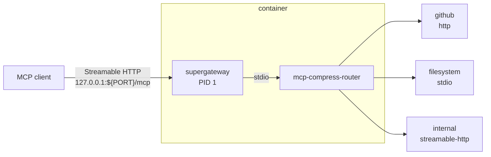
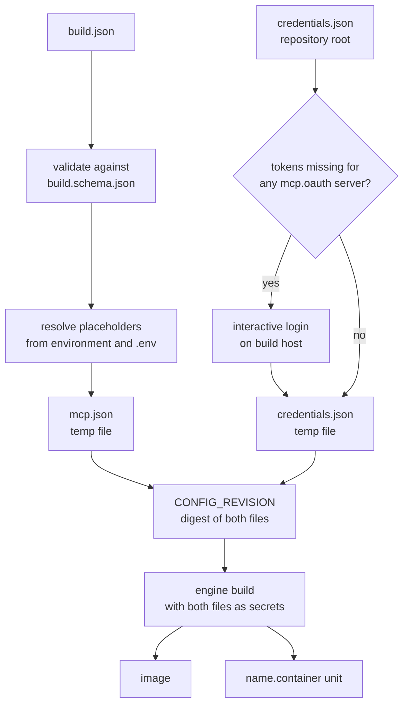
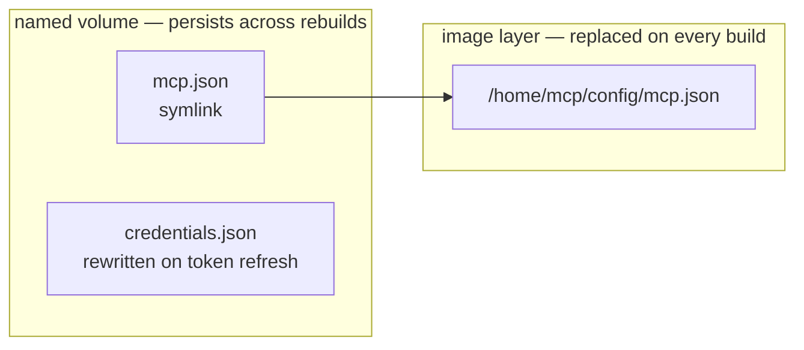

# mcp-aggregator

Builds a container image that presents any number of MCP servers to a local client as a single Streamable HTTP endpoint, collapsed behind the two tools that [
`mcp-compress-router`](https://www.npmjs.com/package/mcp-compress-router) exposes: `get_tool_schema` and `invoke_tool`.

Agent clients cap the number of registered tools — 128 for GitHub Copilot CLI — and every registered tool consumes context whether it is called. Routing servers through the compressor keeps them all
reachable at a fixed cost of two tools.

## Architecture



Configuration is baked into the image at build time as build secrets, so a running container needs no host configuration beyond a state volume.

## Requirements

- Node.js **>= 24** on the build host. `build.cjs` itself needs only 20.12 for `process.loadEnvFile()`, but the OAuth login path runs `mcp-compress-router` through `npx`, and that package requires
  Node 24
- Podman, or Docker via `build.engine`
- `npm install` once, for the `ajv` schema validator

## Configuration

`build.json` is git-ignored and must be created before the first build. It is validated against `build.schema.json` on every run; the `$schema` reference enables editor completion and inline
validation.

| Key                                  | Purpose                                                                                                                                                             |
|--------------------------------------|---------------------------------------------------------------------------------------------------------------------------------------------------------------------|
| `build.engine`                       | `podman` or `docker`                                                                                                                                                |
| `build.name` / `build.tag`           | Image coordinates, overridable with the `IMAGE_NAME` environment variable                                                                                           |
| `build.port`                         | Streamable HTTP port, used inside the container and for the published host binding. Optional, default `20000`                                                       |
| `build.args`                         | `--build-arg` values, and the source of truth for the pinned `SUPERGATEWAY_VERSION` and `MCP_ROUTER_VERSION`. The `ARG` defaults in the Containerfile are fallbacks |
| `build.podman.generate_quadlet_unit` | Emit a `<name>.container` systemd unit alongside the image                                                                                                          |
| `mcp.servers`                        | Downstream servers, written verbatim into the router's `mcp.json` under `mcpServers`                                                                                |
| `mcp.oauth`                          | Server names requiring an interactive login on the build host                                                                                                       |

A server is `stdio` and requires `command`, or `http` / `streamable-http` and requires `url`. Unknown fields pass through to `mcp.json` untouched, so router features absent from the schema still work.
Recognized extras include `compressionLevel`, `allowedTools` and `disabledTools` (picomatch globs), and `enabled`.

```json
{
	"$schema": "build.schema.json",
	"build": {
		"engine": "podman",
		"name": "mcp-aggregator",
		"tag": "latest",
		"port": 20000,
		"args": [
			"MCP_ROUTER_VERSION=1.5.4",
			"SUPERGATEWAY_VERSION=3.4.3"
		],
		"podman": {
			"generate_quadlet_unit": true
		}
	},
	"mcp": {
		"servers": {
			"github": {
				"type": "http",
				"url": "https://api.githubcopilot.com/mcp/",
				"description": "GitHub MCP Server",
				"compressionLevel": "high",
				"headers": {
					"Authorization": "Bearer ${GITHUB_MCP_PAT}"
				}
			},
			"filesystem": {
				"type": "stdio",
				"command": "npx",
				"args": [
					"-y",
					"@modelcontextprotocol/server-filesystem",
					"/data"
				],
				"env": {
					"LOG_LEVEL": "${FS_LOG_LEVEL:-warn}"
				},
				"disabledTools": [
					"*write*",
					"*delete*"
				]
			},
			"internal": {
				"type": "streamable-http",
				"url": "${INTERNAL_MCP_URL}",
				"compressionLevel": "max",
				"allowedTools": [
					"search_*",
					"get_*"
				],
				"oauth": {
					"clientId": "${INTERNAL_CLIENT_ID}",
					"scope": "read",
					"callbackPort": 33418
				}
			}
		},
		"oauth": [
			"internal"
		]
	}
}
```

### Placeholders

Credentials belong in placeholders, not in `build.json`. Any `${VAR}` in `mcp.servers` resolves against the environment, falling back to a `.env` file in the repository root. `${VAR:-default}` is
supported, and an unset placeholder without a default aborts the build. Environment values take precedence over `.env`.

`.env` and `credentials.json` are git-ignored and excluded from the build context. They reach the image only through `--secret` mounts, which leave no trace in any layer.

## Building

```bash
npm install          # once
npm run build        # or: node build.cjs
```



`build.cjs` invokes the engine directly with no connection argument, so with Podman the image is created on whichever connection is currently default. `podman system connection list` shows which that
is.

## OAuth

The router's authorization-code flow needs a browser, which a container build cannot provide, so login runs on the build host. The resulting token store is cached in `credentials.json` at the
repository root and later builds are non-interactive. Only servers with no stored `access_token` are authorized:

```bash
npm run login    # or: node build.cjs --login — re-authorize every server in mcp.oauth
```

## Deploying

With `generate_quadlet_unit` enabled, a successful build writes `mcp-aggregator.container`:

```bash
mkdir -p ~/.config/containers/systemd
cp mcp-aggregator.container ~/.config/containers/systemd/
systemctl --user daemon-reload
systemctl --user start mcp-aggregator
```

Quadlet honours `[Install]`, so `daemon-reload` is sufficient for the unit to start at boot and there is no `enable` step. A rootless service that must survive logout also needs
`loginctl enable-linger "$USER"` once.

The unit binds to `127.0.0.1` only, mounts the host CA bundle read-only, keeps router state in a named volume, and runs with `RunInit=true`.

## Connecting a client

```
http://127.0.0.1:20000/mcp
```

The port follows `build.port`.

## Runtime behaviour

### Configuration storage

The named volume holds router state across rebuilds, which means image content written beneath it is seeded exactly once. The two configuration files therefore live in different places:



`credentials.json` persists because the router rewrites it whenever a token refreshes, and those tokens must outlive a rebuild. `mcp.json` is a symlink out to plain image content, so a rebuild always
supplies the current server configuration.

### Layer caching

Container engines do not invalidate a cached `RUN` when the contents of a mounted secret change. `build.cjs` hashes the generated `mcp.json` and `credentials.json` and passes the digest as
`CONFIG_REVISION`, so that layer rebuilds when the configuration changes and only then.

### Entrypoint

Exec-form `ENTRYPOINT` performs no variable substitution, so the Containerfile writes `/usr/local/bin/entrypoint` at build time with `build.port` already substituted. The script `exec`s supergateway,
which therefore remains PID 1 and receives signals directly. It exists only inside the image.

### Sessions

supergateway runs in stateful mode, so one router process serves every session. In stateless mode it starts a router per session, and concurrent processes overwrite each other's refreshed OAuth
tokens.

### Health

supergateway registers `--healthEndpoint` and `--cors` only for SSE and WebSocket output modes, so neither is available over Streamable HTTP. The quadlet restarts the container when the process exits,
and cannot detect a process that is running but unresponsive.

### Build context

The Containerfile has no `COPY`, and `.containerignore` excludes everything except the Containerfile and files matching `podman-build-secret-*`. Both negations are load-bearing. With `*` alone the
build cannot resolve the Containerfile, and podman-remote transports `--secret` sources inside the context tarball under generated names of that form, so excluding them fails the build with a
server-side rename error. Docker sends secrets over the BuildKit session rather than the context, where the second negation is inert.

## Files

| Path                       | Role                                                          |
|----------------------------|---------------------------------------------------------------|
| `build.cjs`                | Build driver: validate, resolve, authorize, build, emit unit  |
| `build.json`               | Build and server configuration (gitignored)                   |
| `build.schema.json`        | JSON Schema for `build.json`                                  |
| `Containerfile`            | Image definition                                              |
| `.containerignore`         | Deny-all with a single exception                              |
| `.env`                     | Placeholder values (gitignored)                               |
| `credentials.json`         | Cached OAuth token store (gitignored, created on first login) |
| `mcp-aggregator.container` | Generated Quadlet unit (gitignored)                           |

## Licence

[MIT](LICENSE.md) © Džiugas Eiva
